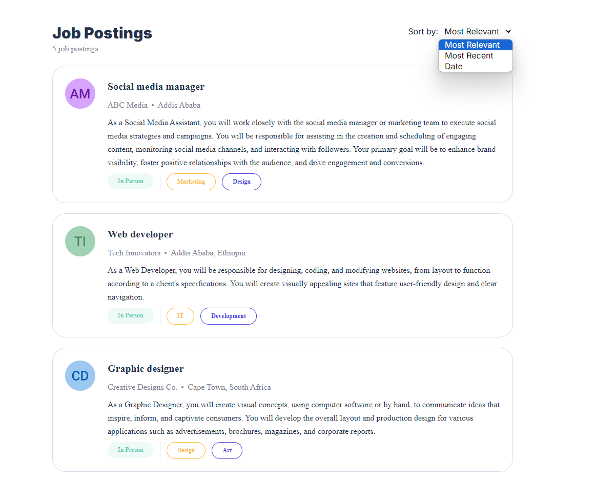
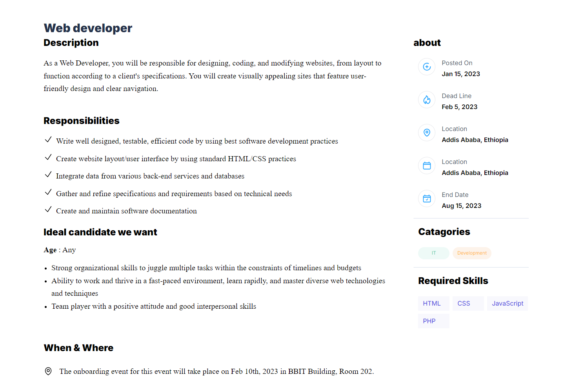

# Job Postings Dashboard

---

This is a React-based job postings dashboard built with Next.js and TypeScript. The application displays a list of job postings, allowing users to view and sort them based on different criteria.

## Features

- **Job Postings Display:** Dynamically displays job postings fetched from a JSON file.
- **Sorting Options:** Users can sort job postings by relevance, recency, or date.
- **Dynamic Routing:** Each job posting links to a detailed description page using Next.js dynamic routing.
- **Styled Components:** Utilizes modern UI components for a clean and responsive design.

## Tech Stack

- **Next.js:** For server-side rendering and routing.
- **React:** For building the user interface.
- **TypeScript:** For type safety and enhanced development experience.
- **Tailwind CSS:** For utility-first CSS styling.

## Setup

1. **Clone the Repository:**

   ```bash
   git clone https://github.com/your-username/your-repository.git
   ```

2. **Navigate to the Project Directory:**

   ```bash
   cd your-repository
   ```

3. **Install Dependencies:**

   ```bash
   npm install
   ```

4. **Run the Development Server:**

   ```bash
   npm run dev
   ```

5. **Open your browser and go to:** `http://localhost:3000`

## Files

- `pages/index.tsx`: Main page displaying job postings.
- `components/CardComponent.tsx`: Card component used to display individual job postings.
- `components/DescComponent.tsx`: Component for displaying detailed descriptions (currently not used in the example).
- `jobs.json`: JSON file containing sample job postings data.

## Contributing

Feel free to fork the repository and submit pull requests. For any issues or feature requests, please create an issue in the GitHub repository.

## License

---




